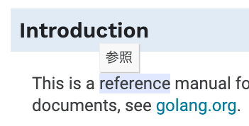

# Go Language Specification Dictionary Extension

- This is a Chrome extension to add dictionary to Go's official documents.

## Features

- Add dictionary to Go's official documents
  - [x] [Go Spec](https://golang.org/ref/spec)
  - [x] [Go Blog](https://blog.golang.org/)
  - [x] [Documentation](https://golang.org/doc/)
  - [x] [Design Docs](https://go.googlesource.com/proposal/+/refs/heads/master/design/)
  - [x] [Go Wiki](https://github.com/golang/go/wiki)
- [x] Automatically update translation resources
- [ ] Multiple languages support

## License

MIT

This project is based on [gospec](https://github.com/DQNEO/gospec) and [gospec-analyzer](https://github.com/DQNEO/gospec-analyzer) by @DQNEO.
